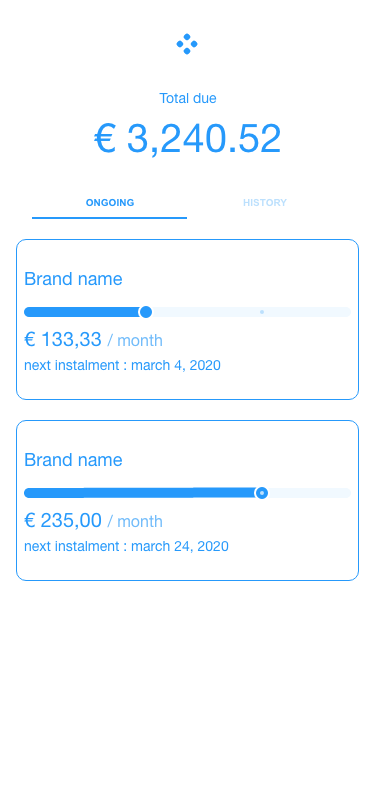
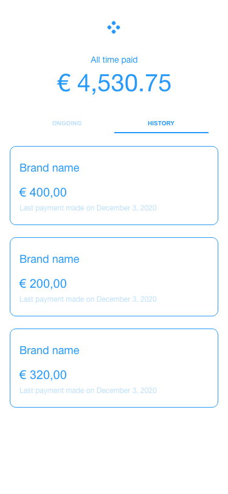

# Cresh Frontend Engineering Technical Tests - Typescript Flavor

This is a little challenge to help us assess your skills as a developer.

A particular attention will be taken to your Code Structure, your ability to express data models and UI components structure.

We expect to have a clean file structure in your final project.

## Context

At Cresh we provide credit at shopping cart, instantly.
We aim to ease the way consumers can get the products they want from any shop, both online and instore.

To do so, we provide several apps, both B2B and B2C along with some APIs.

## Instructions

To realize this test, you can choose one of the following framework you're the most confortable with.

- Angular [cli](https://cli.angular.io/)
- React [reactApp](https://create-react-app.dev/docs/getting-started/)
- VueJS [vuecli](https://cli.vuejs.org/)
- ... or even Vanilla

Setup your project either manually or with one of the framework recommendations.

**/!\ Do not use JQuery. Ever.**

For this challenge we would like you to replicate a screen from our app.

It displays 2 tabs, one for ongoing instalments and the other for payments history.
At the top you have the total still due and the total spent, in that order.

## Constraints

- You must use Typescript as it is widely used across our code.
- Though the screens are aimed to be displayed on a mobile screen, they should adapt on a variety of screen sizes to demonstrate your ability to handle responsive mode.
- You are free to use any design you'd like, either from your own creation or using some existing template.

### Blueprints

Ongoing | History
:-:|:-:
 | 

### Server

Backend is not the subject of this test.  
We provide a simple node server for this part, you are not supposed to change anything in it.

Here is simple instructions on how to setup your local server for the project :

1. install the node dependencies  
  `npm install`

2. run the local API server  
  `npm run api`

3. everything is setup you can now access the list of transactions at :  
  `http://localhost:3000/transactions`

## What's evaluated

- Cleanliness & structure of the code
- Code extensibility
- Documentation
- Respect of KISS and DRY principles
- Use of unit git commits

## Bonus points

- UI/UX design
- Writing unittests
- CSS animations

## Deliverable

Please **clone** (do not fork) this repository and send us a zip or a manual link to your repo.

**Good luck and have fun !**
